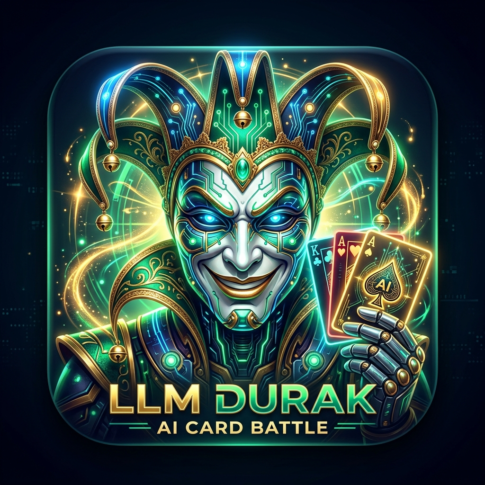

<div align="center">



# 🃏 LLM Дурак — Битва Нейросетей и Людей

**Интерактивная карточная игра в «Дурака» (Подкидной и Переводной) с живыми LLM-соперниками, стримингом мыслей CoT, трэштоком и голосовой озвучкой.**

[](https://github.com/tombreplacer/llm-durak/actions/workflows/ci.yml)
[](https://github.com/tombreplacer/llm-durak/actions/workflows/deploy.yml)
[](https://react.dev/)
[](https://www.typescriptlang.org/)
[](https://vitejs.dev/)
[](https://tailwindcss.com/)
[](https://opensource.org/licenses/MIT)

[🎮 Играть Онлайн](https://tombreplacer.github.io/llm-durak/) • [✨ Возможности](#-особенности-и-возможности) • [🚀 Быстрый старт](#-быстрый-старт) • [🤖 Провайдеры ИИ](#-поддерживаемые-провайдеры-нейросетей) • [⚙️ Архитектура](#-архитектура-и-стек)

</div>

---

## 🌟 Особенности и возможности

### 🃏 Аутентичные правила игры «Дурак»
* **Два режима**: **Подкидной** и **Переводной** дурак.
* **Честная валидация ходов**: Арбитр правил на TypeScript со строгой валидацией подкидывания, перевода карт, первого отбоя (до 5 карт) и ничьих.
* **Гибкий стол (2–4 игрока)**: Играйте 1 на 1 или собирайте компанию из людей и ИИ-ботов в любых комбинациях.

### 🤖 Продвинутый ИИ с личностью и эмоциями
* **7 уникальных колоритных персонажей**:
  * 🍺 **Николаич (Батя Двора)** — легенда лавочки с отборным сочным матом и лавочным сленгом.
  * 🃏 **Семён «Шулер»** — карточный волк, мастер блефа и точного подсчёта карт.
  * 🎓 **Проф. Менделеев-Тервер** — академик теории вероятностей, байесовских расчётов и дискретной оптимизации.
  * 🧢 **Дерзкий Пацанчик** — гроза района, мастер перевода стрелок и наглого трэштока.
  * 👵 **Баба Нюра** — ветеран преферанса и секи, добрая с виду бабушка, которая методично оставляет всех с погонами.
  * 🐗 **Кабан (Вор в законе)** — мрачный авторитетный смотрящий за столом, играет строго по понятиям.
  * 🤖 **Neural Durak AI** — минимакс карточный нейро-движок с холодной логикой без лишних эмоций.
* **✨ Волшебная палочка (ИИ-Генератор персонажей)**: Создавайте и редактируйте собственных ботов прямо в игре с генерацией промпта и характера через LLM.
* **🧠 Стриминг Chain-of-Thought**: Просматривайте скрытый мыслительный процесс нейросетей в реальном времени со счётчиком токенов в секунду и отслеживанием ошибок модели.
* **💬 Двусторонний трэшток**: Боты комментируют каждый ход, а игрок может отправить собственную реплику через поле ввода или быстрые фразы.
* **🎙️ Озвучка реплик**: Реалистичный синтез речи через Web Speech API с индивидуальными тембрами и тональностями для каждого персонажа.

### 💸 Прозрачный финансовый и игровой учёт
* **Счёт за сеанс**: Автоматическое накопление статистики побед (🏆) и поражений (💩) за игровую сессию.
* **Трекер расходов на токены**: Калькулятор стоимости запросов в реальном времени с поддержкой валют **RUB, USD, EUR, KZT, CNY** и онлайн-обновлением курсов валют.

### 📱 Премиальный адаптивный дизайн
* **Атмосферный коричневый деревянный стол** с реалистичной текстурой, деревянными бортами, звуковыми эффектами сброса карт и козырей.
* **Оптимизация под мобильные экраны (iOS/Android)**: Без вертикального скролла (`100dvh`), с вытягивающимся свайпом сайдбаром управления.

---

## 🤖 Поддерживаемые провайдеры нейросетей

| Провайдер | Тип | Описание |
| :--- | :---: | :--- |
| **🌸 Pollinations AI** *(По умолчанию)* | Облако (Бесплатно) | 180+ моделей (OpenAI GPT-5/4o, Claude 3.7 Hybrid, DeepSeek Pro/R1, Gemini 2.0 Flash, Llama 3.3). Готов к игре из коробки! |
| **💻 LM Studio** | Локально | Локальные открытые модели (GGUF: Qwen, Llama, DeepSeek, Mistral) без интернета и затрат на токены. |
| **🌐 OpenRouter** | Облако (API Key) | Доступ к сотням передовых моделей с точным расчётом стоимости генерации. |
| **⚙️ Custom OpenAI API** | Свой сервер | Подключение Ollama (`http://localhost:11434/v1`), официального DeepSeek API, Groq Cloud, Together AI, vLLM или любого прокси. |

---

## 🚀 Быстрый старт

### Требования
* [Node.js](https://nodejs.org/) (версия 20 или новее)
* [pnpm](https://pnpm.io/) (рекомендуется) или `npm` / `yarn`

### 1. Клонирование репозитория
```bash
git clone https://github.com/tombreplacer/llm-durak.git
cd llm-durak
```

### 2. Установка зависимостей
```bash
pnpm install
```

### 3. Запуск сервера разработки
```bash
pnpm dev
```
Откройте браузер по адресу: `http://localhost:5173/`

### 4. Сборка для продакшена
```bash
pnpm build
```

---

## ⚙️ Архитектура и стек

```
llm-durak/
├── src/
│   ├── components/
│   │   ├── Cards/              # Рендеринг карт, мастей, рубашек и анимаций
│   │   ├── CardTable/          # Игровой стол, колода, козыри и бито
│   │   ├── GameControls/       # Панель управления ходом, трэшток и боковой сайдбар
│   │   ├── GameOverModal/      # Окно результатов партии и статистика сеанса
│   │   ├── MoveHistory/        # Лог ходов, реплик и стоимости токенов
│   │   ├── OpponentSeat/       # Места соперников, аватарки, статусы и облачка речи
│   │   ├── PlayerHand/         # Рука игрока с динамическим веером карт
│   │   ├── SettingsModal/      # Настройки моделей, провайдеров, валюты и персонажей
│   │   └── Thinking/           # Стриминг внутреннего монолога CoT
│   ├── services/
│   │   ├── characterService.ts # Менеджер персонажей и генерация через LLM
│   │   ├── currencyService.ts  # Мультивалютная конвертация и курсы ЦБ
│   │   ├── durakEngine.ts      # Ядро правил (Подкидной / Переводной)
│   │   ├── durakJudge.ts       # LLM Арбитр: промпты, стриминг и ретраи ходов
│   │   ├── llmClient.ts        # Клиент Pollinations, LM Studio, OpenRouter, Custom API
│   │   ├── prompts.ts          # Системные промпты и форматирование JSON-ходов
│   │   ├── soundEffects.ts     # Синтезатор звуков Web Audio API
│   │   └── speechService.ts    # Озвучка голосов Web Speech API
│   ├── types/
│   │   └── durak.ts            # TypeScript интерфейсы и типы игры
│   ├── App.tsx                 # Главный компонент и игровой цикл
│   └── index.css               # Стили Tailwind CSS и дизайн стола
├── .github/
│   └── workflows/
│       ├── ci.yml              # Проверка типов и сборка PR / Push
│       └── deploy.yml          # Автодеплой на GitHub Pages
└── package.json
```

---

## 📄 Лицензия

Распространяется под лицензией **MIT**. Подробности в файле [LICENSE](./LICENSE) (при наличии).

---

<div align="center">
  Разработано с ❤️ и азартом. Пусть победит сильнейший интеллект! 🃏🤖
</div>
